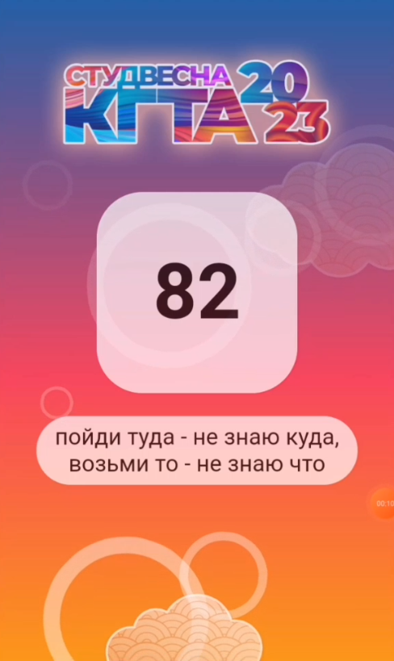

# Студенческая лотерея

Данное приложение было разработоно для студенческой весны КГТА - 2023.
Приложение позволяет запускать лотерею среди участников и по команде от организатора выводить на экран победителей.

Приложение было успешно протестировано и запущено на мероприятии с более 200 учасниками.

## Технологии

backend: Golang;
brontend: ReactJS, HTML, CSS.

### Запуск приложений

Для запуска frontend части нужно из папки frontend запустить команду `npm start`

Для запуска backend части нужно из папки backend запустить команду `go run ./cmd/app`

